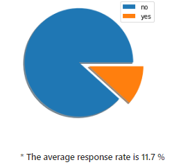
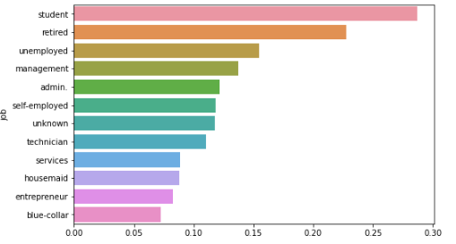

# Customer_response
To identify the potential customers who responded well to the campaign and then gather more insights from there

## Comprehension
ASCB Bank is a fictional bank that conducted a marketing campaign recently in order to understand its customer demographics and offered a new scheme that they have employed. The following dataset contains information related to the entire campaign. The major variable that is needed to be investigated is the 'response' which determines whether the customer responded 'yes' or 'no' to the new scheme.

### Questions 

#### 1. What is the average response rate across all the customers?
* The average response rate is 11.7 %
<kbd>    </kbd>

#### 2. Which are the job categories that have the top 2 average response rates?
* job categories that have the top 2 average response rates are 'student' and 'retired'
<kbd>    </kbd>
 
#### 3. How many job categories have a response rate of less than than 9%.
* 4 job categories have a response rate of less than 9%.

#### 4. For which job category is the average balance for the customers who responded 'yes' to the campaign is lower than the average balance of those who responded 'no' to the campaign?
* we can see that 2 job categories follow this trend.

#### 5. For which job category is the average balance for the customers who responded 'yes' to the campaign is lower than the average balance of those who responded 'no' to the campaign?
* we can clearly see that the unemployed category shows this behaviour

## Conculsions
* Historically, the trends have shown that most working professionals(categories other than the student and retired) have a much higher response rate to the campaign than the student or the retired category. But here we see that it is not the case. ('student' and 'retired') have highest respose rate on average.
* The given result shows that the two categories which generally don't have high response rates have now shown the highest response rate. Thus the insight is a surprising extreme.
* There are 4 (blue-collar, entrepreneur, housemaid,services )categories which follow a certain trend that might be insightful was unknown to us previously, it follows the 'unknown result' pattern of insight.
